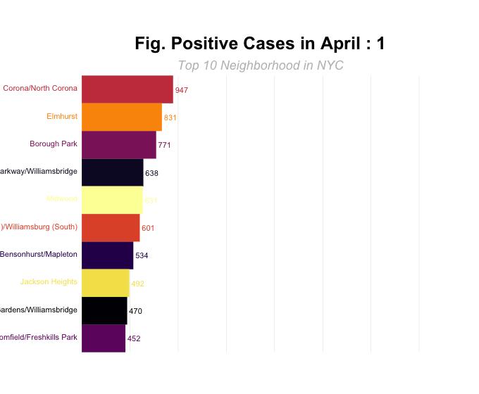

```{r, message=FALSE, include=FALSE}
library(tidyverse)
library(viridis)

library(plotly)
```

#Trends Gif




# Time Trends

```{r}
Aprildata_with_nebhod = read_csv("./data/Aprildata_with_nebhod.csv")
```

```{r}
library(ggplot2)
library(gganimate)
library(tidyverse)

library(leaflet)
library(maps)
library(tigris)
library(sf)
spdf2 = read_sf("/Users/ziqizhou/Desktop/MSPH_1st_Year/P8105_Data_Science/Git/zipcode_covid-19/data/Geography-resources/MODZCTA_2010_WGS1984.geo.json")
```


```{r}
Aprildata_with_nebhod_break = Aprildata_with_nebhod
Aprildata_with_nebhod_break$positive = cut(Aprildata_with_nebhod$positive, 
                                     breaks = c(0,50,100,200,500,1000,
                                                2000,3000,4000,10000),
                                     labels = c('0-50','50-100','100-200','200-500',
                                                '500-1000','1000-2000',
                                                '2000-3000','3000-4000','4000+'),
                                   order = TRUE,include.lowest = TRUE, right = TRUE)
```


```{r}
#for April map

for (i in 1:30) {
 p =  Aprildata_with_nebhod_break %>% 
    filter(date == i) %>% 
   mutate(MODZCTA = as.character(MODZCTA)) %>% 
   select(-zcta_cum_perc_pos) %>% 
    left_join(spdf2, ., by = c('MODZCTA' = 'MODZCTA')) 
 p = subset(p, !is.na(positive))
    
plot =   ggplot(p) + 
    geom_sf(aes(fill = positive)) + 
    coord_sf()+
    scale_fill_brewer(palette = "OrRd",direction = 1) + 
    labs(title = paste0("Positive Cases in NYC at zipcode level on April: ",i))

  
  ggsave(filename = paste0(i,"Apr.png"),
 plot = plot, path = "/Users/ziqizhou/Desktop/MSPH_1st_Year/P8105_Data_Science/Git/NYC_covid-19.github.io/data/pics",
width = 20, height = 20, units = "cm")
}

```

```{r}
library(magick)
list.files(path='./data/pics', pattern = '*.png', full.names = TRUE) %>% 
        image_read() %>% # reads each path file
        image_join() %>% # joins image
        image_animate(fps=4) %>% # animates, can opt for number of loops
        image_write("Aprmap.gif")
```

```{r}
animate_p = image_animate(image=image_read(path=paste0("/Users/ziqizhou/Desktop/MSPH_1st_Year/P8105_Data_Science/Git/NYC_covid-19.github.io/data/pics","/",i,"Apr.png")))

anim_save(filename = "aprmap.gif",animation = animate_p,path="/Users/ziqizhou/Desktop/MSPH_1st_Year/P8105_Data_Science/Git/NYC_covid-19.github.io/data/pics")

print(animate_p)

```

#### Neighborhoods
```{r}
household_raw = read_csv("./data/predictor_data/household_zipcode_nyc.csv") %>% select(-1)
household = left_join(household_raw, data_by_modzcta) %>% 
  select(zipcode, neighborhood_name, borough_group, everything()) %>% 
  rename(size_2 = person_2,
         size_1 = person_1,
         size_3 = person_3,
         size_4 = person_4,
         size_5 = person_5,
         size_6 = person_6,
         size_7_or_more = person_7_or_more)
```


```{r}
house_nbh = household %>% 
      filter(neighborhood_name == "Financial District") %>%
      pivot_longer(size_1:size_7_or_more, names_to = "size", values_to = "number") %>%
      group_by(neighborhood_name, size) %>% 
      summarise(num = sum(number)) %>% 
      mutate(size = str_replace_all(size,"size_1","Size 1"),
             size = str_replace_all(size,"size_2","Size 2"),
             size = str_replace_all(size,"size_3","Size 3"),
             size = str_replace_all(size,"size_4","Size 4"),
             size = str_replace_all(size,"size_5","Size 5"),
             size = str_replace_all(size,"size_6","Size 6"),
             size = str_replace_all(size,"size_7_or_more","Size 7 or more")) %>% 
      mutate(size = factor(size)) %>% 
      drop_na()
    
    which_boro = race %>% filter(neighborhood_name == "Financial District") %>% select(borough_group) %>% unique()
    
    house_gp = household %>% 
      filter(borough_group == which_boro$borough_group) %>% 
      pivot_longer(size_1:size_7_or_more, names_to = "size", values_to = "number") %>% 
      group_by(size) %>% 
      summarise(num = sum(number)) %>% 
      mutate(size = str_replace_all(size,"size_1","Size 1"),
             size = str_replace_all(size,"size_2","Size 2"),
             size = str_replace_all(size,"size_3","Size 3"),
             size = str_replace_all(size,"size_4","Size 4"),
             size = str_replace_all(size,"size_5","Size 5"),
             size = str_replace_all(size,"size_6","Size 6"),
             size = str_replace_all(size,"size_7_or_more","Size 7 or more")) %>% 
      mutate(size = factor(size)) %>% 
      drop_na() 
    
    
    house_nyc = household %>% 
      pivot_longer(size_1:size_7_or_more, names_to = "size", values_to = "number") %>%
      group_by(size) %>% 
      summarise(num = sum(number)) %>% 
      mutate(size = str_replace_all(size,"size_1","Size 1"),
             size = str_replace_all(size,"size_2","Size 2"),
             size = str_replace_all(size,"size_3","Size 3"),
             size = str_replace_all(size,"size_4","Size 4"),
             size = str_replace_all(size,"size_5","Size 5"),
             size = str_replace_all(size,"size_6","Size 6"),
             size = str_replace_all(size,"size_7_or_more","Size 7 or more")) %>% 
      mutate(size = factor(size)) %>% 
      drop_na()
    
    plot = plot_ly(sort = FALSE)
    
    plot = plot %>% 
      add_trace(data = house_nbh,
                labels = ~house_nbh$size,
                values = ~house_nbh$num,
                text = ~paste(round((num/sum(num))*100, digits = 1),"%"),
                textinfo='text',
                textposition="auto",
                type = 'pie',
                name = ~house_nbh$neighborhood_name,
                domain = list(row = 0, column = 0))
    
    
    plot = plot %>% 
      add_trace(data = house_gp,
                labels = ~house_gp$size,
                values = ~house_gp$num,
                text = ~paste(round((num/sum(num))*100, digits = 1),"%"),
                textinfo='text',
                textposition="auto",
                type = 'pie',
                name = ~which_boro,
                domain = list(row = 0, column = 1))
    
    
    plot = plot %>% 
      add_trace(data = house_nyc,
                labels = ~house_nyc$size,
                values = ~house_nyc$num,
                text = ~paste(round((num/sum(num))*100, digits = 1),"%"),
                textinfo='text',
                textposition="auto",
                type = 'pie',
                name = ~paste("New York City"),
                domain = list(row = 0, column = 2))
    
    plot = plot %>%
      layout(title = "", showlegend = T,
             grid=list(rows=1, columns=3),
             xaxis = list(showgrid = F, zeroline = FALSE, showticklabels = F),
             yaxis = list(showgrid = F, zeroline = FALSE, showticklabels = F),
             legend=list(title=list(text='<b> Family Size </b>'), orientation = 'h', xanchor = "center", x = 0.5, y = -0.5)) %>% 
      add_annotations(x=seq(0.15,0.15+2*0.35,0.35),
                      y=-0.3,
                      text = c(paste(input$nbhid1), paste(which_boro), "New York City"),
                      xref = "paper",
                      yref = "paper",
                      xanchor = "center",
                      showarrow = FALSE
      )
    
    plot
```


